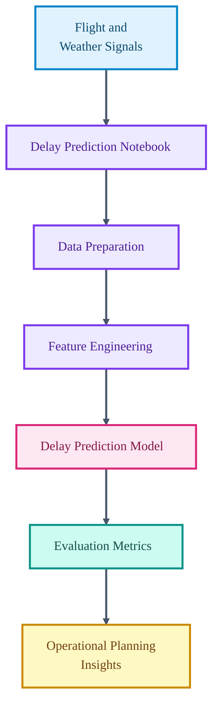

# Optimizing Air Travel

<p align="center">

  
  
  
  
</p>

<p align="center">
  <strong>A flight-delay prediction workflow using historical flight and weather-driven operational signals.</strong>
</p>

Optimizing Air Travel models flight-delay risk as a predictive analytics problem. The project uses notebook-based analysis to prepare data, train models, evaluate performance, and communicate operational insights.

## Core Capabilities

- Prepares flight-delay data for predictive modeling.
- Builds machine learning models for delay classification or regression.
- Evaluates results through notebook diagnostics.
- Frames predictions for planning and mitigation use cases.

## Technical Architecture

The repository contains a single primary notebook that captures the workflow from data preparation to model evaluation. The README gives reviewers a concise map of the project and execution path.

## Architecture Diagram



## Technology Stack

- Python notebook workflow.
- Pandas and NumPy for tabular data processing.
- scikit-learn style model training and evaluation.
- Visualization for model diagnostics and insight communication.

## Repository Structure

- `airline_delay_prediction.ipynb` - End-to-end flight-delay prediction notebook.
- `README.md` - Project documentation.

## Getting Started

```bash
python -m venv .venv
source .venv/bin/activate
pip install pandas numpy scikit-learn matplotlib seaborn jupyter
```

```bash
jupyter notebook airline_delay_prediction.ipynb
```

## Professional Context

This project demonstrates transport analytics, predictive modeling, and operational data-science communication.
